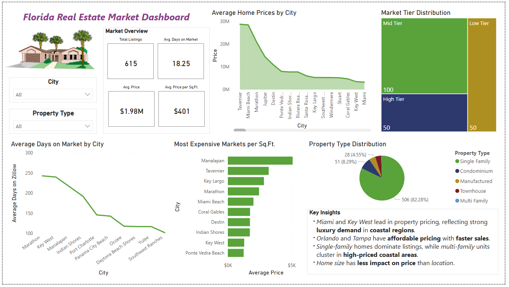

# Florida-Real-Estate-Market-Analysis

### Skills: SQL, Power BI

## Executive Summary:
This project analyzes Florida real estate market trends using housing data from Zillow.The goal was to uncover key factors influencing property prices, market activity, and affordability across different cities in Florida.
Through SQL-based data exploration and a Power BI dashboard, this project provides data-driven insights for real estate investors.

## Business Problem:
**Question: What factors drive property pricing and market activity across Florida’s cities?** 

It is important for investors to know which cities offer the best value, where properties sell fastest, and how pricing patterns differ by property type and size.

## Methodology:

### 1. Data Cleaning & Preparation:
* Loaded Zillow property data into SQL Server
* Checked for missing or inconsistent values and standardized data types

### 2. Exploratory Data Analysis with SQL
* Calculated average property prices, days on market, and price per square foot by city
* Analyzed property type distributions and price differences by bedroom/bathroom combinations
* Segmented cities into low, mid, and high-tier markets based on quartile pricing

### 3. Visualization in Power BI
* Built an interactive dashboard showing price trends, market tiers, and city comparisons
* Designed visuals including bar charts, pie charts, and treemaps

  

  

## Key Findings: 
* Miami and Key West lead in property pricing.
* Orlando and Tampa have affordable pricing with faster sales.
* Single-family homes dominate listings, while multi-family units are more common in high-priced coastal areas.
* Home size has less impact on price than location.

## Insights:
* Miami and Key West attract high-income buyers and investors looking for luxury properties.
* Orlando and Tampa have a steady demand in mid-tiered markets and may be ideal for investors seeking quicker sales and stable returns.
*  There is a growing interest in city living and vacation rentals near coastal cities.
*  Buyers and sellers should focus more on where the home is located rather than how big it is when setting prices or investing.

## Business Recommendations for Investors: 
* Use Miami and Key West for long-term, high-value investments, focusing on luxury and vacation properties that appreciate steadily over time.
* Focus on Orlando and Tampa for faster sales and stable rental demand, which provide good value and faster returns.
* Consider multi-family or condo investments in urban and coastal markets where rental or vacation demand is rising.
* Combining quick-turnover properties (Orlando, Tampa) with luxury, slow-growth assets (Miami, Key West) could reduce portfolio risk and capture different market opportunities.

## 
### 
